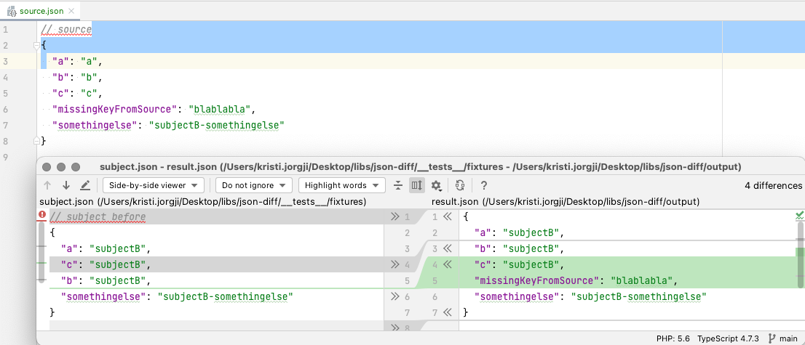

# json-tools

This tool allows you to compare 2 files in json format and do different actions with them.

It is especially useful for translation files.

Example: You have en.json keys filled but some of those keys are missing in de.json. The tool will add the keys to de.json and you can fill the translated value afterwards.

# Getting started
run `yarn install` or `npm install`


## To fill in the missing keys from source.json to dest.json and sort the keys in dest.json to match the order in source.json run:
```
yarn start fill:diff --sourcePath=source.json--subjectPath=dest.json --destPath=result.json
```

The result for the source, subject in the example above would be:



You can see the subject keys are 
* sorted to match the order in source
* the missing keys from source to subject are added with the source value
!Note: This command assumes that subject has no extra keys that source has 

## License

json-tools is released under the MIT Licence @kristijorgji. See the bundled LICENSE file for details.
